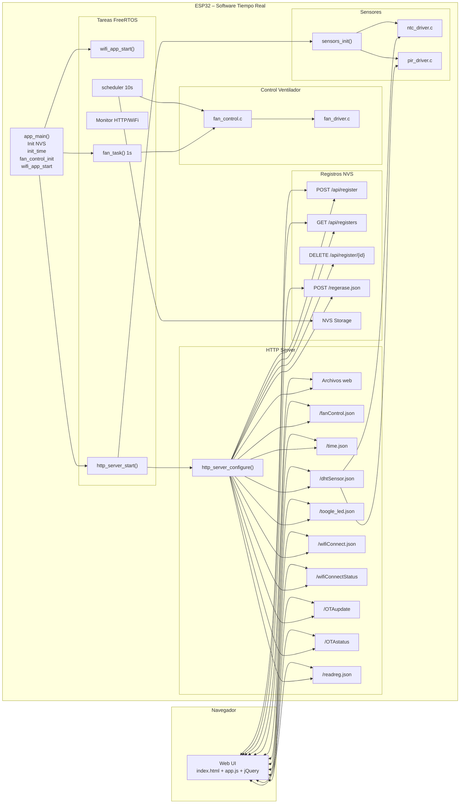
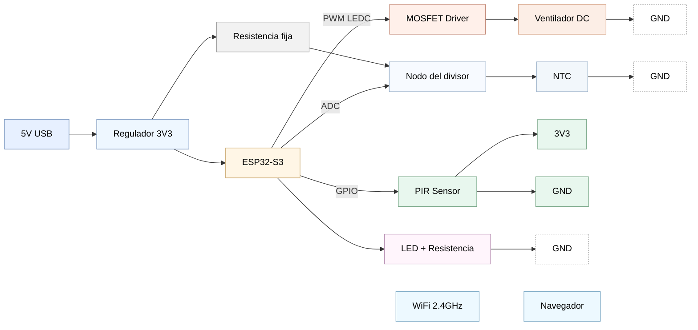

#  Ventilador Inteligente para Cuna – ESP32-S3  
Sistema en Tiempo Real • PWM • Sensores • Web UI • OTA • WiFi • NVS

Este proyecto implementa un **ventilador inteligente para cuna** basado en **ESP32-S3** con:

- Control de ventilador por **PWM (LEDC)**  
- Sensores de **temperatura (NTC)** y **movimiento (PIR)**  
- Interfaz web para usuario (modo, velocidad, horarios)  
- Programación de horarios persistentes en **NVS**  
- Actualización de firmware por **OTA**  
- Funcionamiento en **tiempo real** con varias tareas **FreeRTOS**  

---

## 1️ Arquitectura general del sistema

Componentes principales del firmware:

- **Servidor HTTP** con API REST y archivos embebidos:
  - `index.html`, `app.css`, `app.js`, `jquery-3.3.1.min.js`
- **Módulo WiFi**:
  - Modo AP/STA, credenciales guardadas en NVS
- **Control del ventilador**:
  - `fan_control.c` (lógica de modos)
  - `fan_driver.c` (PWM LEDC)
- **Sensores**:
  - `ntc_driver.c` (temperatura)
  - `pir_driver.c` (detección de movimiento)
- **Registros programados**:
  - `registers.c` (API + scheduler)
  - Datos guardados en NVS (namespace `"storage"`)
- **Soporte OTA**:
  - Subida de firmware vía `/OTAupdate`
- **Tareas FreeRTOS**:
  - WiFi, HTTP server, monitor, control de ventilador, scheduler de registros

---

## 2️ Flujo de arranque – `app_main()`

La función principal inicializa los servicios básicos y arranca las tareas.

```c
void app_main(void)
{
    // 1. Inicializar NVS
    esp_err_t ret = nvs_flash_init();
    if (ret == ESP_ERR_NVS_NO_FREE_PAGES || ret == ESP_ERR_NVS_NEW_VERSION_FOUND) {
        ESP_ERROR_CHECK(nvs_flash_erase());
        ret = nvs_flash_init();
    }
    ESP_ERROR_CHECK(ret);

    // 2. Inicializar control del ventilador
    fan_control_init();

    // 3. Crear tarea de control periódico
    xTaskCreate(fan_task, "fan_task", 4096, NULL, 5, NULL);

    // 4. Inicializar hora (SNTP)
    init_obtain_time();

    // 5. Configurar LED de estado
    configure_led();

    // 6. Iniciar aplicación WiFi (AP/STA + HTTP server)
    wifi_app_start();
}
```

---

## 3️ Tareas FreeRTOS y responsabilidades

- **`WIFI_APP_TASK`**  
  - Configuración AP/STA  
  - Lectura/guardado de credenciales  
  - Conexión a redes externas

- **`HTTP_SERVER_TASK`**  
  - Ejecuta `http_server_start()`  
  - Configura el servidor HTTP y registra todos los endpoints  
  - Inicializa sensores (`sensors_init()`)

- **`HTTP_SERVER_MONITOR_TASK`**  
  - Procesa mensajes de la cola:
    - Estado WiFi (conectando / conectado / fallo)
    - Resultado de OTA (éxito / fallo)
  - Dispara el reinicio tras actualización de firmware

- **`FAN_TASK`**  
  - Ejecuta `fan_control_update()` cada 1 s  
  - En modo AUTO lee la temperatura NTC  
  - Ajusta el PWM según la lógica de `fan_control.c`

- **`REG_SCHED_TASK`** (en `registers.c`)  
  - Cada 10 s:
    - Lee registros 1..10 desde NVS  
    - Verifica si **algún registro coincide** con la hora/día actual  
    - Llama `fan_control_on_register_tick(any_match_now)`

---

## 4️ Modos de operación del ventilador

Implementados en `fan_control.c`.

### 🔹 Modo MANUAL (`FAN_MODE_MANUAL`)
- La velocidad viene directamente del **slider** en la Web UI.  
- `fan_control_set_manual_speed(percent)` guarda el valor y, si el modo es MANUAL, llama a `fan_set_speed_percent()`.

### 🔹 Modo AUTOMÁTICO (`FAN_MODE_AUTO`)
- Usa la lectura del NTC (temperatura en °C).  
- Regla implementada:

  - **< 25 °C** → 0 % (apagado)  
  - **25–30 °C** → rampa lineal 0–100 %  
  - **> 30 °C** → 100 %  

- Opcionalmente se puede considerar PIR para apagar si no hay movimiento (comentado en código).

### 🔹 Modo REGISTROS (`FAN_MODE_REGISTERS`)
- El ventilador **solo puede encenderse** si algún registro está activo en ese momento.  
- El scheduler (`registers_scheduler_task`) marca `s_reg_active = true/false` mediante `fan_control_on_register_tick()`.  
- Si `s_reg_active == true`, el ventilador se enciende con la velocidad configurada (slider).  
- Si no hay registros activos, el ventilador se apaga.

---

## 5️ API HTTP principal

### Endpoints de control y monitoreo

- `GET /`  
  Devuelve la página principal (`index.html`).

- `GET /app.js`, `GET /app.css`, `GET /jquery-3.3.1.min.js`, `GET /favicon.ico`  
  Archivos estáticos embebidos en el firmware.

- `POST /fanControl.json`  
  JSON de entrada:
  ```json
  {
    "mode": "manual" | "auto" | "registros",
    "speed": 0-100
  }
  ```
  Actualiza el modo y la velocidad y devuelve:
  ```json
  {
    "status": "ok",
    "mode": "...",
    "speed": 50
  }
  ```

- `GET /dhtSensor.json`  
  Devuelve temperatura NTC y estado PIR:
  ```json
  {
    "temp": 27.5,
    "pir": 0 | 1
  }
  ```

- `GET /time.json`  
  Devuelve fecha y hora del ESP (SNTP):
  ```json
  {
    "date": "YYYY-MM-DD",
    "time": "HH:MM:SS"
  }
  ```

- `POST /toogle_led.json`  
  Cambia el estado del LED conectado a `BLINK_GPIO`.

### Endpoints WiFi

- `POST /wifiConnect.json`  
  Recibe SSID y password en JSON y actualiza credenciales, luego intenta conectar.

- `POST /wifiConnectStatus`  
  Devuelve:
  ```json
  { "wifi_connect_status": 0 | 1 | 2 | 3 }
  ```

### OTA

- `POST /OTAupdate`  
  Recibe el binario de firmware por HTTP y lo escribe en la partición de actualización.

- `POST /OTAstatus`  
  Devuelve estado de la última actualización:
  ```json
  {
    "ota_update_status": -1 | 0 | 1,
    "compile_time": "HH:MM:SS",
    "compile_date": "MMM DD YYYY"
  }
  ```

---

## 6️ Registros programados (NVS)

Cada registro se guarda en NVS como JSON (clave `"reg_X"` para X=1..10), por ejemplo:

```json
{
  "hour": 21,
  "minute": 30,
  "days": ["L", "M", "X"]
}
```

- `save_register_to_nvs(int id, reg_t *reg)`  
  Convierte la estructura `reg_t` a JSON y la guarda en NVS.

- `load_register_from_nvs(int id, char *buffer, size_t buffer_len)`  
  Recupera el JSON como cadena.

- `load_register_struct_from_nvs(int id, reg_t *out)`  
  Parsea el JSON y arma la estructura `reg_t` (hora, minuto y arreglo de días).

- `register_is_active_now(const reg_t *reg)`  
  Compara la hora/minuto/día actual con el contenido del registro.

### Endpoints relacionados

- `POST /api/register`  
  Guarda un registro con el siguiente JSON:
  ```json
  {
    "register": 1,
    "hour": 21,
    "minute": 30,
    "days": ["L", "M", "X"]
  }
  ```

- `GET /api/registers`  
  Devuelve JSON con todos los registros (1..10).

- `DELETE /api/register/{id}`  
  Elimina el registro `id` de NVS.

- `GET /readreg.json`  
  Endpoint de compatibilidad para el front-end antiguo, devuelve cadenas tipo `"HHMMLMX"`.

- `POST /regerase.json`  
  Versión legacy para borrar un registro a partir de `"selectedNumber"`.

---

## 7️⃣ Diagrama de software (Mermaid)



---

## 8 Diagrama de conexiones de hardware 



---

## 9 Cómo compilar y flashear

1. Instalar **ESP-IDF** (versión usada en el proyecto).  
2. Clonar el repositorio del proyecto.  
3. Configurar el proyecto:
   ```bash
   idf.py menuconfig
   ```
4. Compilar:
   ```bash
   idf.py build
   ```
5. Flashear:
   ```bash
   idf.py -p /dev/ttyUSB0 flash
   ```
6. Monitor serie:
   ```bash
   idf.py -p /dev/ttyUSB0 monitor
   ```

---

## 10 Notas finales

- Los registros, credenciales WiFi y configuración persisten gracias a **NVS**.  
- El diseño está orientado a **sistemas en tiempo real**, con separación clara de tareas y responsabilidades.  
- La Web UI permite controlar prácticamente todo:  
  - Modo de operación  
  - Velocidad  
  - Programación de horarios  
  - Estado de WiFi y del sistema  

Este README resume la arquitectura de software y hardware del **Ventilador Inteligente para Cuna** y sirve como base para documentación académica y futuras extensiones del proyecto.
