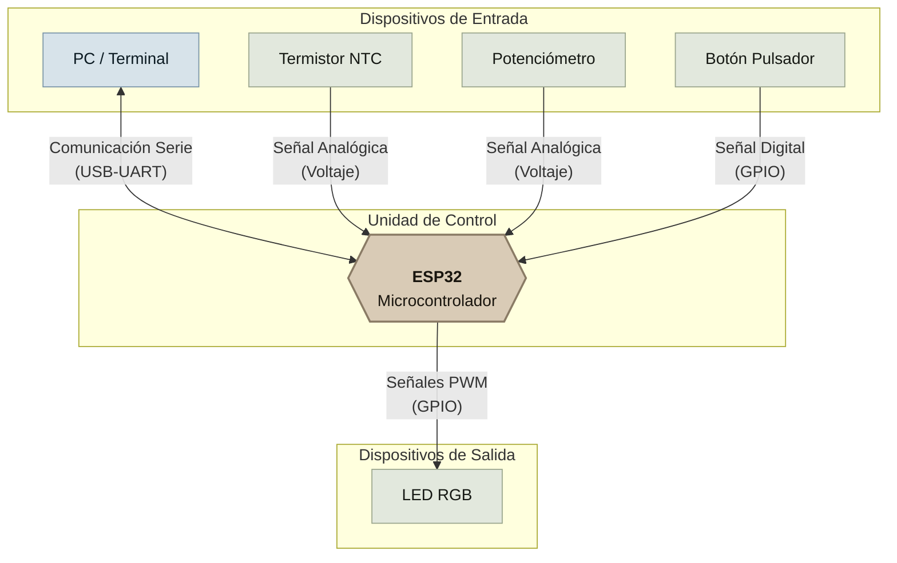
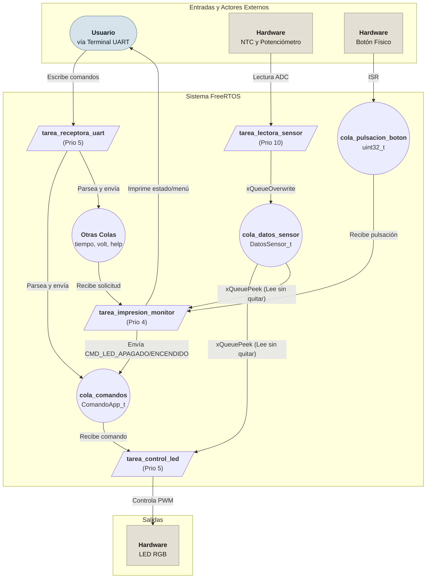

# Tarea Parcial: Sistemas en Tiempo Real

*   **Fecha:** Noviembre, 2025
*   **Integrantes:**
    *   Luis Fernando Gamba
    *   Hernan Jair Telpiz
*   **Institución:** Universidad Nacional de Colombia - Sede Manizales

## Resumen del Proyecto

En el trabajo actual se desarrolla un sistema embebido multitarea utilizando el sistema operativo de tiempo real **FreeRTOS** sobre un microcontrolador ESP32-s3. El objetivo principal es usar y controlar diversos periféricos (un LED RGB, un termistor NTC, un potenciómetro y un botón) de manera concurrente y reactiva.

La solución se basa en una arquitectura de tareas y colas para desacoplar los distintos módulos del sistema, como la lectura de sensores, la recepción de comandos del usuario y el control del actuador principal. Cada tarea tiene una prioridad asignada para garantizar la correcta ejecución del sistema.

## Diagrama de sofware y hadware

## Arquitectura del Software

El sistema está dividido en cuatro tareas principales que se comunican a través de colas, garantizando un diseño modular y no bloqueante.

1.  **`tarea_receptora_uart` (Prioridad 5):**
    *   **Responsabilidad:** Actúa como el "recepcionista". Escucha permanentemente el puerto serie (UART) en busca de comandos enviados por el usuario.
    *   **Funcionamiento:** Parsea los comandos recibidos y los traduce en mensajes que envía a la `cola_comandos` para que otras tareas actúen en consecuencia.

2.  **`tarea_lectora_sensor` (Prioridad 10 - La más alta):**
    *   **Responsabilidad:** Es el "técnico de mediciones". Se encarga de leer los valores de los sensores de forma periódica e independiente del resto del sistema.
    *   **Funcionamiento:** Cada 200 ms, lee la temperatura del sensor NTC y el voltaje del potenciómetro. Aplica un filtro de media móvil a las últimas 10 lecturas de temperatura para suavizar el valor. El dato consolidado (`temperatura` y `voltaje`) se envía a la `cola_datos_sensor`.

3.  **`tarea_control_led` (Prioridad 5):**
    *   **Responsabilidad:** El "operario principal". Su única función es controlar el color y la intensidad del LED RGB.
    *   **Funcionamiento:** Constantemente verifica si hay nuevos comandos en la `cola_comandos` o nuevos datos de sensores en la `cola_datos_sensor`. Basado en el modo de operación actual, ajusta el ciclo de trabajo (PWM) de cada canal del LED.

4.  **`tarea_impresion_monitor` (Prioridad 4):**
    *   **Responsabilidad:** El "supervisor de interfaz". Gestiona toda la interacción visual con el usuario en el terminal serie.
    *   **Funcionamiento:** Controla el estado del sistema (Modo Monitor vs. Modo Configuración) y decide qué información mostrar en pantalla.

## Funcionalidades

### 1. Interacción por UART

El puerto serie es el principal medio para configurar el sistema. Se puede acceder a él con cualquier programa de terminal (ej. PuTTY, Monitor Serie de VSCode/IDF) a **115200 baudios**.

#### Comandos Disponibles:

*   `R <min> <max>`: Define el rango de temperatura (en °C) para el canal **ROJO**. El brillo del rojo será 0% en `min` y 100% en `max`.
    *   *Ejemplo: `R 15.0 25.5`*
*   `G <min> <max>`: Define el rango de temperatura para el canal **VERDE**.
    *   *Ejemplo: `G 20.0 30.0`*
*   `B <min> <max>`: Define el rango de temperatura para el canal **AZUL**.
    *   *Ejemplo: `B 28.0 35.0`*
*   `pot <valor>`: Fija un brillo estático para los tres colores del LED, desactivando el control por temperatura. El valor es un porcentaje entre 0.0 y 100.0.
    *   *Ejemplo: `pot 75.5`*
*   `volt`: Solicita una lectura inmediata del voltaje del potenciómetro y la muestra en pantalla.
*   `tiempo <ciclos>`: Modifica la frecuencia con la que se actualizan los datos en el "Modo Monitor". El valor es el número de ciclos de 100ms.
    *   *Ejemplo: `tiempo 10` imprime datos cada 1 segundo (10 * 100ms).*
*   `help`: Muestra nuevamente el menú de comandos.

### 2. Interacción con el Botón Físico

El botón físico permite alternar entre dos modos principales de operación:

*   **Modo Monitor (Estado Inicial):**
    *   La terminal muestra continuamente las lecturas de los sensores: `Temp: XX.XX C | Pot: YYYY mV`.
    *   El LED RGB está activo y su comportamiento depende de la configuración recibida por UART (control por temperatura o brillo fijo).

*   **Modo Configuración:**
    *   Al presionar el botón, el monitor de sensores se detiene.
    *   El LED RGB se apaga para indicar que el control está en pausa.
    *   Se imprime un menú de ayuda en la terminal, permitiendo al usuario ingresar comandos sin que la pantalla se llene de lecturas de sensores.
    *   Una nueva pulsación del botón devuelve el sistema al **Modo Monitor**.

### 3. Control del LED RGB y Sensores

*   **Potenciómetro:** Es leído constantemente por la `tarea_lectora_sensor` y su valor en milivoltios se reporta en el Modo Monitor. También puede ser consultado bajo demanda con el comando `volt`.
*   **Sensor de Temperatura (NTC):** Su lectura es la base para el modo de control principal. El sistema interpola linealmente la temperatura actual dentro de los rangos definidos para cada color (`R`, `G`, `B`) para generar mezclas de colores dinámicas. Por ejemplo, si la temperatura aumenta, el sistema puede hacer una transición suave de azul a verde y luego a rojo, dependiendo de los rangos configurados.

## Estructura de Ficheros

El proyecto está organizado en módulos o "drivers", cada uno con su archivo de cabecera (`.h`) y de código fuente (`.c`), promoviendo la reutilización y el orden.

*   `main_u.c`: Contiene la función `app_main`, la creación de las tareas y colas, y la implementación de las cuatro tareas principales del sistema.
*   `button_driver.c / .h`: Encapsula la configuración del GPIO para el botón y la lógica de interrupción para detectar pulsaciones.
*   `ntc_driver.c / .h`: Contiene la lógica para leer el conversor Analógico-Digital (ADC) conectado al NTC y la fórmula para convertir ese valor a grados Celsius.
*   `pot_driver.c / .h`: Se encarga de leer el canal del ADC correspondiente al potenciómetro y convertirlo a milivoltios.
*   `rgb_led_driver.c / .h`: Abstrae el control del LED RGB, utilizando el periférico PWM del ESP32 para gestionar el brillo de cada canal de color.
*   `CMakeLists.txt`: Archivo de configuración del sistema de compilación (CMake) para el framework ESP-IDF.